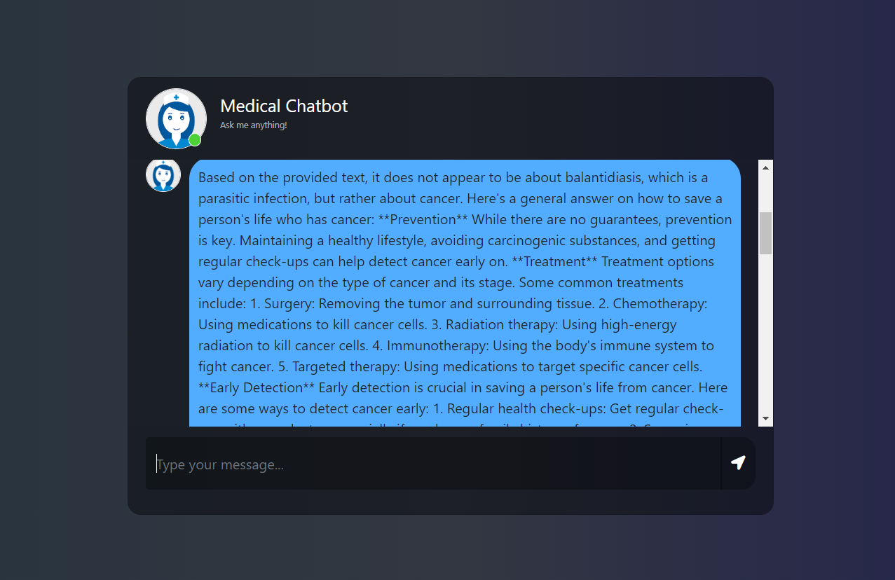
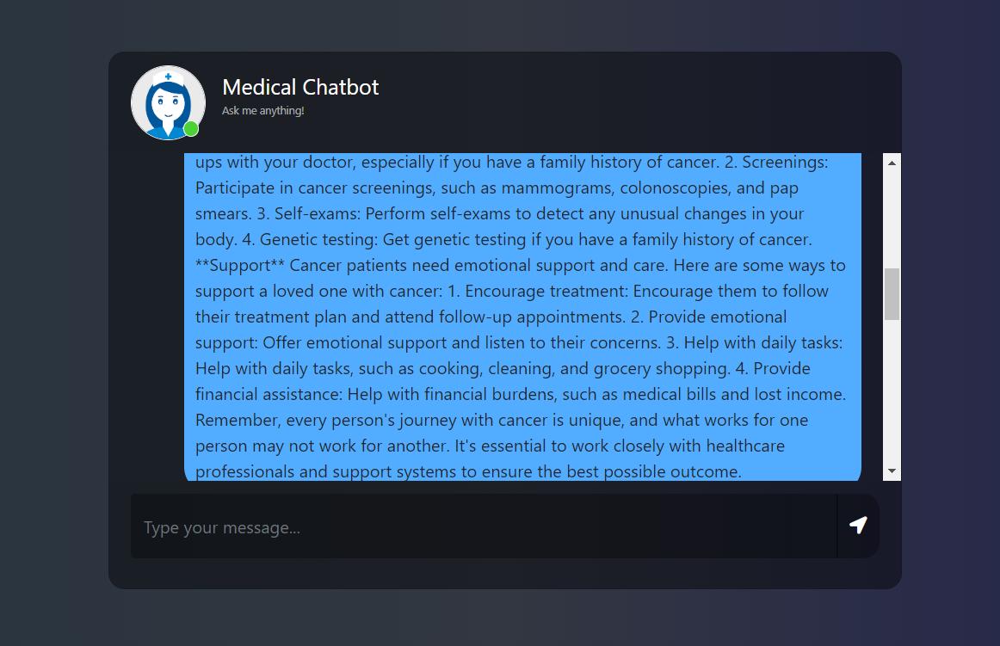
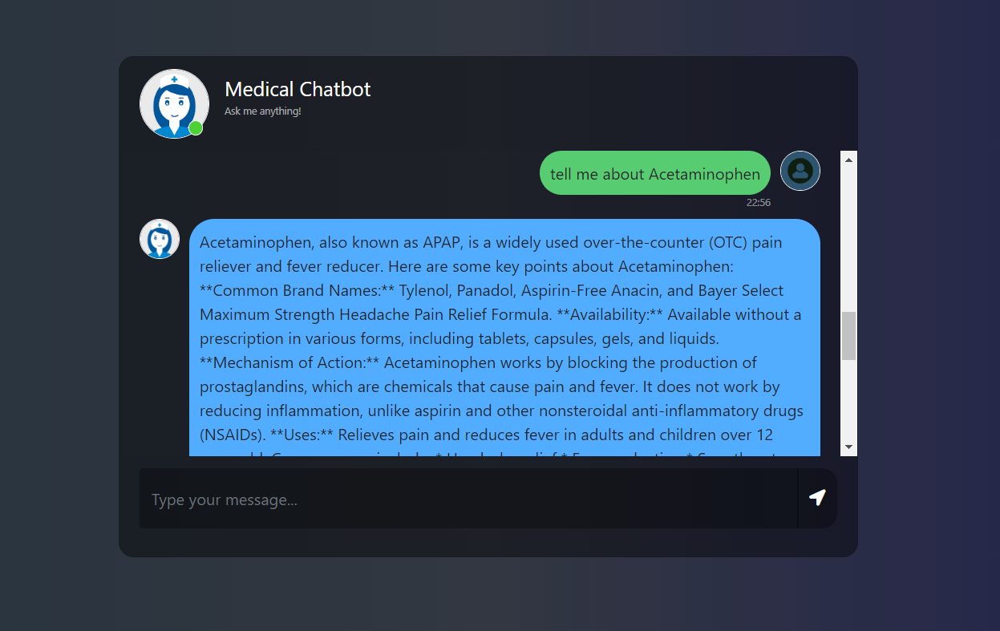
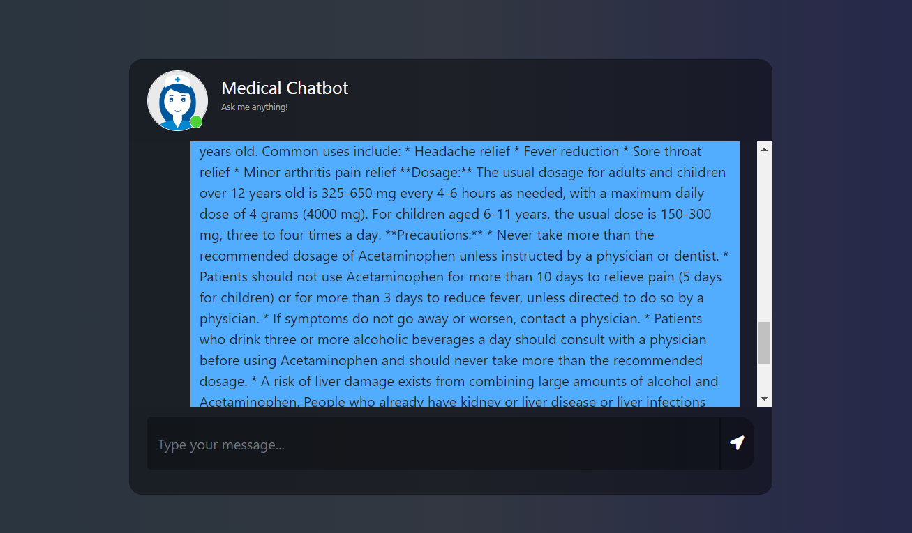

# End-to-end-Medical-Chatbot-using-Llama2
- In this project, I implement a **MADICAL-CHATBOT** by using FLASK (Web framework) and FAISS (Building a vector storage) and LangChain i.e RAG(Retrieval Augmented Generation) implemantation to finetune model "meta-llama/Meta-Llama-3-8B-Instruct" on given dataset Madecal Book(GALE ENCYCLOPEDIA of MEDICINE) and ask question from this book, So this madical chatbot generate good responce from this book.
- Result
- 
- 
- 
- 
- 

###### ============================= Descrived Implementation ======================================== #####
- Create requirement.txt file and write every libary whatever you need in project.
- Create reserch folder and make jyupitor notebook of our project
- Creting Modular Coading Pipeline
- -------> For doing manually to create folder name we make a template.py file and created all folder using OS.
- --------> For setup any file in local peackage so that i can easily import function from that file, for doing this we create a setup.py file
- --------> Ok, Now goes to src/helper.py file and paste my code of documents(data) and emebeddings regarding and this file imported in store_index.py file.
- Now finnaly create app.py and put model pipeline and question-answering regarding full code,
- create one chatboot templte from html and css store in templtes and static folder, so just import in my app.py folder

###### =============================================================================================== #####


#### How to run?
- Clone the repository

```bash
Project repo: https://github.com/
```

-  STEP 01- Create a conda environment after opening the repository

```bash
conda create -n mchatbot python=3.8 -y
```

```bash
conda activate mchatbot
```

- STEP 02- install the requirements
```bash
pip install -r requirements.txt
```

```bash
# run the following command
python store_index.py
```

```bash
# Finally run the following command
python app.py
```

```bash
open up localhost:
```

#### Techstack Used:
- Python
- LangChain
- Flask
- Meta Llama3
- FAISS